# Schone Halacha Prompting

> An Angular application for generating structured halachic analyses from Hebrew text using AI-powered markdown formatting.

---

## 1. Introduction and Goals

This application addresses the challenge of converting complex Hebrew halachic texts into clear, structured German analyses that maintain the scholarly rigor while being accessible to a broader audience.

* **Problem:** Traditional halachic texts are often inaccessible to non-Hebrew speakers, and manual translation/analysis is time-consuming and inconsistent.
* **Solution:** An AI-powered application that automatically generates structured, well-formatted halachic analyses in German with proper markdown formatting and scholarly citations.
* **Key Goals:**
    * **Goal:** Reduce manual halachic text summary time by 80% through automated AI processing.
    * **Goal:** Achieve consistent formatting and structure across all generated analyses.
    * **Goal:** Provide accessible halachic content to German-speaking Jewish communities.
    * **Goal:** Maintain religious compliance by displaying בס״ד (B'siyata D'shmaya) as required by Jewish tradition.

### Religious Requirements

This application follows Jewish religious requirements by prominently displaying בס״ד (B'siyata D'shmaya - "With the help of Heaven") in the upper right corner of the application toolbar. This acknowledgment is a traditional Jewish practice when creating religious or scholarly content, recognizing that all wisdom comes from divine assistance.

---

## 2. System Context (C4 Model: Level 1)

This diagram shows how the Schone Halacha system integrates with users and external services.

```
+------------------+     +------------------+     +------------------+
|   User (Rabbi/   |     |  Schone Halacha  |     |   Google Gemini  |
|   Student)       |---->|   Application    |---->|      API         |
|                  |     |                  |     |                  |
+------------------+     +------------------+     +------------------+
         |                        |                        |
         | Uses                   | Generates              | Processes
         v                        v                        v
+------------------+     +------------------+     +------------------+
|   Hebrew Text    |     |  Markdown       |     |  AI Summary     |
|   Input          |     |  Output         |     |  & Translation   |
+------------------+     +------------------+     +------------------+
```

---

## 3. Solution Strategy & Technology Stack

This section describes the high-level technical decisions and the technologies used.

* **Architecture:** Modern Angular standalone application with Firebase backend
* **Primary Language:** TypeScript
* **Frameworks:** Angular 20, Angular Material
* **AI/ML:** Google Gemini 2.5 Pro API via Firebase Functions
* **Backend:** Firebase Functions with HTTP endpoint at `https://europe-west1-fir-prompting.cloudfunctions.net/getHalachaSummary`
* **Deployment:** Firebase Hosting with multi-language routing
* **Styling:** SCSS with Material Design Azure Blue theme and RTL support

---

## 4. Requirements & Feature Set

This table tracks the curated set of functional requirements for this project.

| ID      | Status      | Feature                | Requirement Description                                                                | Rationale                                           |
| :------ | :---------- | :--------------------- | :------------------------------------------------------------------------------------- | :-------------------------------------------------- |
| REQ-001 | `Done`      | Hebrew Text Input      | As a user, I can input Hebrew halachic text and the halacha number is automatically extracted.              | To provide the source material for AI analysis.     |
| REQ-002 | `Done`      | AI Summary            | As a user, I can generate structured summary in multiple languages using Google Gemini API.          | To automate the translation and summary process.    |
| REQ-003 | `Done`      | Markdown Rendering     | As a user, I can view beautifully formatted markdown output with proper styling.        | To ensure readability and professional presentation. |
| REQ-004 | `Done`      | Copy to Clipboard      | As a user, I can copy the generated summary to clipboard for external use.            | To enable easy sharing and integration with other tools. |
| REQ-005 | `Done`      | Responsive Design      | As a user, I can use the application on desktop and mobile devices.                   | To ensure accessibility across different devices.     |
| REQ-006 | `Done`      | Error Handling         | As a user, I receive clear error messages when the API fails or input is invalid.      | To provide a robust user experience.                |
| REQ-007 | `Done`      | Multi-language Support | As a user, I can access the application in German, English, French, Hebrew, and Russian via URL-based routing.         | To make the application accessible to diverse users. |
| REQ-008 | `Done`      | Halacha Number Dialog  | As a user, I can manually enter a halacha number when automatic extraction fails.       | To ensure all texts can be processed even without clear number patterns. |

---

## 5. DevOps & CI/CD

This project implements a comprehensive DevOps pipeline with automated versioning, testing, and deployment.

### 🚀 **Auto-Versioning with Conventional Commits**

The project uses [semantic-release](https://semantic-release.gitbook.io/) to automatically version and release based on conventional commits.

#### **How It Works:**
1. **Conventional Commits**: All commits follow the [Conventional Commits](https://www.conventionalcommits.org/) specification
2. **Automatic Versioning**: When merged to `main`, semantic-release analyzes commit messages and determines the next version
3. **Automatic Releases**: Creates GitHub releases with changelogs and tags

#### **Commit Types & Version Impact:**

| Type | Description | Version Impact |
|------|-------------|----------------|
| `feat` | New features | Minor version bump |
| `fix` | Bug fixes | Patch version bump |
| `docs` | Documentation changes | No version bump |
| `style` | Code style changes | No version bump |
| `refactor` | Code refactoring | No version bump |
| `perf` | Performance improvements | Patch version bump |
| `test` | Adding or updating tests | No version bump |
| `build` | Build system changes | No version bump |
| `ci` | CI/CD changes | No version bump |
| `chore` | Maintenance tasks | No version bump |
| `revert` | Reverting previous commits | Patch version bump |

#### **Breaking Changes:**
Add `!:` after type to trigger major version bump:
```bash
git commit -m "feat!: breaking change description"
```

### 🔄 **GitHub Actions Workflow**

The project uses GitHub Actions for automated CI/CD with two main workflows:

#### **1. Release & Deploy Workflow** (`.github/workflows/firebase-hosting-merge.yml`)
- **Trigger**: Push to `main` branch
- **Jobs**:
  - **Release**: Runs semantic-release to create versions and GitHub releases
  - **Deploy**: Deploys to Firebase Hosting after successful release
- **Features**:
  - Automatic versioning based on conventional commits
  - GitHub release creation with changelogs
  - Firebase deployment with multi-language support
  - Node.js caching for faster builds

#### **2. Pull Request Workflow** (`.github/workflows/firebase-hosting-pull-request.yml`)
- **Trigger**: Pull requests to `main`
- **Purpose**: Preview deployments for PR validation
- **Features**:
  - Build validation
  - Test execution
  - Preview deployment to Firebase

### 🛡️ **Code Quality & Validation**

#### **Git Hooks (Husky)**
- **Pre-commit**: Fast validation (linting + TypeScript)
- **Commit-msg**: Conventional commit format validation
- **Pre-push**: Comprehensive validation (linting + TypeScript + tests + build)

#### **Validation Tools**
- **ESLint**: Code style and quality enforcement
- **TypeScript**: Strict type checking
- **Jasmine/Karma**: Unit testing framework
- **Commitlint**: Conventional commit validation

### 📋 **Quality Assurance Pipeline**

```mermaid
graph LR
    A[Developer] --> B[Pre-commit Hook]
    B --> C[Lint + TypeScript]
    C --> D[Commit]
    D --> E[Pre-push Hook]
    E --> F[Lint + TypeScript + Tests + Build]
    F --> G[Push to Remote]
    G --> H[GitHub Actions]
    H --> I[Release Job]
    I --> J[Semantic Release]
    J --> K[Create GitHub Release]
    K --> L[Deploy Job]
    L --> M[Firebase Deployment]
```



### 🛠️ **DevOps Commands**

```bash
# Setup development environment
npm install
npm run setup-husky

# Quality checks
npm run lint              # ESLint validation
npm test                  # Run tests
npm run build            # Production build
npm run pre-push         # All quality checks

# Conventional commits
git commit -m "feat: add new feature"
git commit -m "fix: resolve bug"
git commit -m "docs: update documentation"

# Skip validation (emergency only)
git commit --no-verify -m "emergency fix"
git commit -m "docs: update README [skip ci]"

# Manual release (if needed)
npm run semantic-release
```

### 🔧 **Environment Configuration**

#### **Required Secrets (GitHub)**
- `GITHUB_TOKEN`: For GitHub API access
- `FIREBASE_SERVICE_ACCOUNT_SHONE_HALACHOT`: Firebase deployment credentials

#### **Firebase Configuration**
- **Project ID**: `fir-prompting`
- **Hosting**: Multi-language deployment
- **Functions**: AI processing backend
- **Environment**: Production-ready with proper security

### 📊 **Monitoring & Observability**

- **GitHub Releases**: Automatic changelog generation
- **Firebase Analytics**: User behavior tracking
- **Error Monitoring**: Firebase Crashlytics integration
- **Performance**: Lighthouse CI integration

### 🚨 **Security & Compliance**

- **Dependency Scanning**: Automated vulnerability detection
- **Code Scanning**: GitHub CodeQL integration
- **Secret Scanning**: Automatic secret detection
- **Branch Protection**: Required reviews and status checks

---

## Getting Started

### Prerequisites

* Node.js (v18 or higher)
* npm or yarn
* Firebase CLI (for deployment)

### Installation

1. **Clone the repository:**
   ```bash
   git clone [your-repo-url]
   cd shone-halacha-prompting
   ```

2. **Install dependencies:**
   ```bash
   npm install
   ```

3. **Set up Git hooks (optional but recommended):**
   ```bash
   npm run setup-hooks
   npm run setup-husky
   ```
   
   > **Note:** Git hooks ensure code quality but are not automatically installed to avoid CI conflicts.

4. **Set up Firebase (for backend functions):**
   ```bash
   npm install -g firebase-tools
   firebase login
   firebase init functions
   ```

5. **Configure environment variables:**
   - Set `GEMINI_KEY` in Firebase Functions environment
   - Configure Firebase project settings

6. **Run the application:**
   ```bash
   # Development (German - default)
   npm start
   
   # Language-specific development servers
   npm run serve:en    # English on http://localhost:4201
   npm run serve:fr    # French on http://localhost:4202
   npm run serve:he    # Hebrew on http://localhost:4203
   npm run serve:ru    # Russian on http://localhost:4204
   
   # Production builds
   npm run build       # All languages
   npm run build:de    # German only
   npm run build:en    # English only
   npm run build:fr    # French only
   npm run build:he    # Hebrew only
   npm run build:ru    # Russian only
   
   # Deploy to Firebase
   npm run deploy:firebase
   ```

### Usage

#### Multi-language Access
The application supports 5 languages with URL-based routing:
- **German (default)**: `http://localhost:4200/` or production domain
- **English**: `http://localhost:4201/` or `/en/` in production
- **French**: `http://localhost:4202/` or `/fr/` in production  
- **Hebrew**: `http://localhost:4203/` or `/he/` in production
- **Russian**: `http://localhost:4204/` or `/ru/` in production

#### Summary Process
1. Navigate to your preferred language version using the URL or language switcher
2. Paste or type Hebrew halachic text in the input field (the halacha number will be automatically extracted)
3. If automatic extraction fails, a dialog will prompt you to enter the halacha number manually
4. Click the "Create Summary" button to generate the summary in your selected language
5. View the beautifully formatted markdown output
6. Use the copy button to copy the result to clipboard

### Features

* **AI-Powered Summary:** Uses Google Gemini 2.5 Pro for intelligent text processing via Firebase Functions
* **Multi-language Support:** Full i18n support with URL-based routing for German, English, French, Hebrew, and Russian
* **Automatic Halacha Number Extraction:** Intelligently extracts halacha numbers from Hebrew text
* **Manual Number Input:** Fallback dialog for manual halacha number entry when automatic extraction fails
* **Structured Output:** Generates well-formatted markdown with proper citations and formatting
* **Responsive Design:** Works seamlessly on desktop and mobile devices with RTL support for Hebrew
* **Modern UI:** Clean, professional interface using Angular Material with Azure Blue theme
* **Real-time Processing:** Immediate feedback and loading states with error handling
* **Copy to Clipboard:** One-click copying of generated analysis for external use
* **Religious Compliance:** Displays בס״ד (B'siyata D'shmaya - "With the help of Heaven") in the upper right corner of the toolbar as required by Jewish tradition

### Quality Assurance

This project maintains high code quality through automated checks:

#### Git Hooks
- **pre-commit**: Fast validation (linting + TypeScript)
- **commit-msg**: Conventional commit format validation
- **pre-push**: Comprehensive validation (linting + TypeScript + tests + build)

#### Manual Quality Checks
```bash
npm run pre-push    # Run all quality checks manually
npm run lint        # ESLint only
npm test           # Tests only
npm run build      # Build only
```

#### Setup for New Developers
Git hooks are not automatically installed to avoid conflicts with CI/CD pipelines. To install them:
```bash
npm run setup-hooks
npm run setup-husky
```

**CI/CD Compatibility:**
The pre-push hook automatically detects CI environments (GitHub Actions, Travis CI, CircleCI, GitLab CI) and skips execution to avoid interfering with automated builds.

### Technology Highlights

* **Angular 20:** Latest Angular with standalone components, signals, and modern features
* **TypeScript:** Strict type checking for robust development
* **Angular Material:** Professional UI components with Azure Blue theme
* **Angular i18n:** Full internationalization support with XLIFF translation files
* **Firebase Functions:** Serverless backend for AI processing via Google Gemini API
* **SCSS:** Advanced styling with responsive design and RTL support
* **Modern Testing:** Comprehensive test suite with modern Angular testing patterns
* **ESLint:** Code quality enforcement with Angular-specific rules
* **Semantic Release:** Automated versioning and release management
* **GitHub Actions:** Comprehensive CI/CD pipeline
* **Firebase Hosting:** Multi-language deployment with automatic scaling
